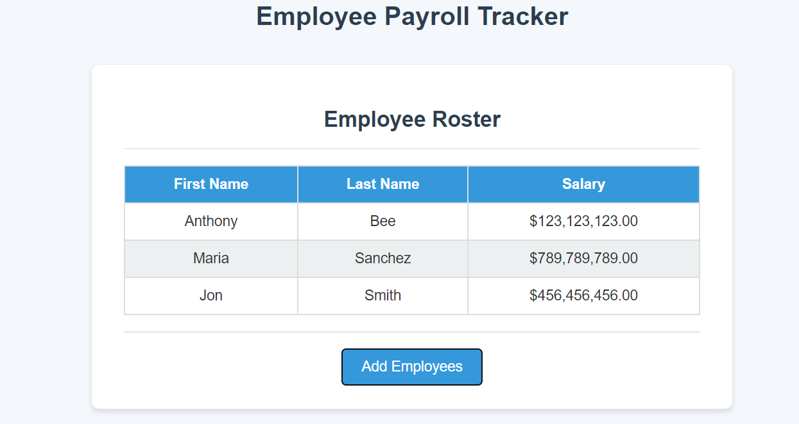

## Description

This project involves creating an employee payroll tracker that allows users to add new employees, input their details, and display sorted employee data with aggregated payroll information.

## Table of Contents

- [Description](#description)
- [Installation](#installation)
- [Usage](#usage)
- [License](#license)
- [Contributing](#contributing)
- [Tests](#tests)
- [Questions](#questions)

## Installation

Load url.Add Employee Workflow:

## Usage

Clicking the "Add Employee" button prompts the user to enter the first name, last name, and salary.

## License

This project is licensed under the MIT license.

## Contributing

After entering the details, users can choose to continue adding employees or cancel.

## Tests

Upon canceling, the employee data is displayed on the page, sorted alphabetically by last name.

## Questions

For any questions, please contact me with the information below:

GitHub: [erinspix](https://github.com/erinspix)  
Email: e.spix@yahoo.com

##What I Learned
JavaScript Prompts: Implemented user input prompts for a seamless data entry process.
Data Sorting: Learned how to sort and display employee data alphabetically by last name.
Aggregation: Gained experience in computing and displaying aggregated payroll data using JavaScript.
User Flow: Improved my understanding of creating user-friendly workflows in web applications.
Conclusion
This employee payroll tracker efficiently handles employee data input, displays it in a user-friendly manner, and provides useful payroll calculations. Future improvements could include adding a feature to edit or delete employee entries and enhancing the user interface.

##Link
https://erinspix.github.io/employee-payroll-tracker/

